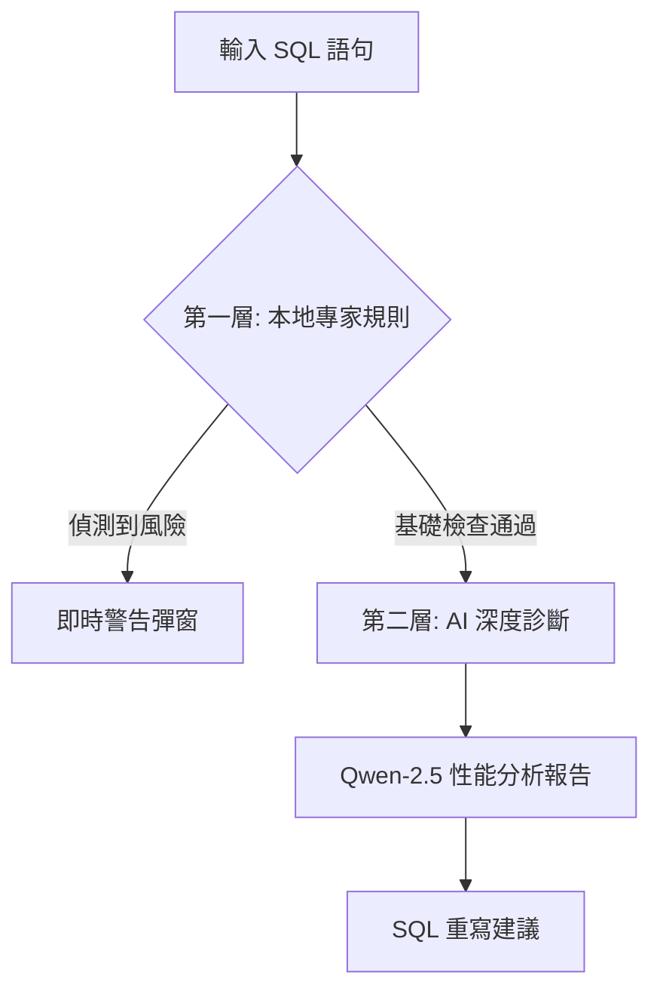

# 🛠️ Smart SQL Auditor (Senior PSR Edition)

這是一個結合了 **資深 PSR 經驗規則** 與 **Qwen-2.5 大語言模型** 的智能 SQL 審計工具。它旨在解決生產環境中因 SQL 疏忽導致的系統崩潰（如無索引查詢、全表更新），將風險排查從「事後修復」提前至「事前預防」。

---

### 🌟 核心亮點
- **雙層審計機制**：
    - **Expert Rules (Local)**：基於 8 年 PSR 經驗，透過正則與邏輯引擎即時偵測全表更新、索引失效、笛卡爾積等高危行為。
    - **AI Diagnostics (Remote)**：整合 Hugging Face Qwen-2.5 模型，提供專業 DBA 等級的 SQL 優化建議與重寫。
- **DevSecOps 導向**：採用 API Token 動態輸入機制，確保生產密鑰不洩漏，符合企業安全規範。
- **高可用設計**：實作模型熱切換與官方 SDK 整合，克服雲端環境網路攔截問題。

---

### 🔄 審計工作流 (Workflow)

### 🚀 快速開始
1. 訪問 https://oPeterOc2.github.io/sql-auditor/
2. 貼入測試 SQL（或使用內建測試案例）
3. 輸入 Hugging Face Token 即可獲得深度 AI 建議

### 🛠️ 技術棧
- Frontend: React.js
- AI SDK: @huggingface/inference
- Model: Qwen/Qwen2.5-7B-Instruct
- Deployment: GitHub Pages

## 🧠 技術實作心得 (Senior Insights)

在開發「智能 SQL 數據審計工具」過程中，針對生產環境支持 (PSR) 的嚴苛要求，本專案克服了以下技術挑戰：

* **SDK-Driven Stability**：初步嘗試使用 REST API 進行模型調用時，發現前端環境處理跨域 (CORS) 與流式傳輸較為繁瑣且不穩定。隨即決定**重構通訊層**，遷移至官方 `@huggingface/inference` SDK，利用其內部封裝的 `chatCompletion` 機制，顯著提升了生產環境下的通訊成功率。
* **Security & Push Protection**：在執行自動化部署 (GitHub Pages) 時，觸發了 GitHub 的 **Push Protection** 機制。這引發了對前端環境變量注入風險的深度思考：識別出 `REACT_APP_` 變量在 Build Time 會被硬編碼至混淆後的代碼中。隨即調整架構，改為「動態輸入密鑰」模式，從源頭解決了 API 配額洩漏的風險。
* **Pattern Recognition Optimization**：針對 Oracle 舊式語法（如逗號分隔多表關聯）與新式 `JOIN` 語法進行邏輯整合，確保審計引擎能覆蓋不同年代的遺留代碼 (Legacy Code)，精準攔截潛在的笛卡爾積 (Cartesian Product) 異常。

## 🛠️ 開發方法論 (Development Methodology)

本專案採用 **AI-Augmented Engineering (AI 增強工程)** 模式實作，這是我作為資深開發者對「AI 協作時代」生產力的實踐：

* **架構師思維 (Architectural Focus)**：將開發精力從瑣碎的 UI CSS 調整轉移至**「PSR 邏輯定義」**與**「AI Prompt Engineering」**。透過定義精確的系統角色 (System Role)，讓 Qwen-2.5 模型能穩定產出具備 Oracle DBA 水準的優化建議。
* **快速原型迭代 (Rapid Prototyping)**：利用 LLM 協作進行代碼建構，將研發重點由傳統的「手工編碼」轉移至**「系統架構設計」**與**「跨環境整合驗證」**。
* **持續優化思維**：面對 SDK 版本更新（如 `HfInference` 標示為已淘汰）時，利用 AI 協助快速定位新版 `InferenceClient` 規範，並在 15 分鐘內完成核心邏輯的平滑遷移，體現了在複雜雲端生態下快速定位問題並交付解決方案的能力。

---

## 👨‍💻 作者與背景 (Author & Background)

**Developed by Chan-Ka-Ho | 2026 Senior Developer AI Transformation Project**

* **資深維運經驗**：擁有約 8 年後端開發與 **PSR (Production Support Request)** 生產支持經驗，深度參與過 SCV (Single Customer View) 等大型企業級系統的維護與開發。
* **技術轉型實踐**：目前專注於 **React** 前端開發與 **AI 工作流自動化**，致力於將傳統資料庫運維中的「專家直覺」轉化為「自動化守衛」。
* **設計初衷**：本專案旨在解決生產環境中因 SQL 疏忽導致的系統崩潰（如無索引查詢、全表更新）。透過整合資深開發者的審計邏輯與 **Qwen-2.5 LLM** 的深度解析，將風險排查從「事後修復」提前至「事前預防」。
* **相關專案**：[Unix O&M Diagnostic Agent](https://github.com/oPeterOc2/unix-ai-agent) — 專注於 Unix 系統層級錯誤自動化診斷的 AIOps 工具。
