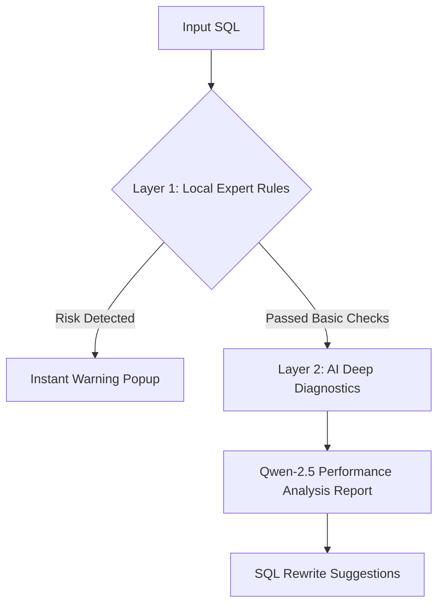

# 🛠️ Smart SQL Auditor (Senior PSR Edition)

This is an intelligent SQL auditing tool that combines **senior PSR expert rules** with the **Qwen-2.5 large language model**.  
It aims to prevent production incidents caused by SQL negligence (such as missing indexes or full‑table updates), shifting risk handling from “post‑incident repair” to “pre‑incident prevention”.

---

### 🌟 Core Highlights
- **Dual‑Layer Auditing Mechanism**:
  - **Expert Rules (Local)**: Based on 8 years of PSR experience, using regex + logic engine to detect high‑risk behaviors such as full‑table updates, index‑missing scans, and Cartesian products.
  - **AI Diagnostics (Remote)**: Integrates Hugging Face Qwen‑2.5 to provide DBA‑level SQL optimization and rewriting suggestions.

- **DevSecOps‑Oriented**: Uses dynamic API Token input to avoid exposing production secrets and comply with enterprise security standards.

- **High Availability Design**: Implements model hot‑switching and official SDK integration to overcome cloud network interception issues.

### 📺 Demo

---

### 🔄 Workflow

### 🚀 Quick Start
1. Visit https://oPeterOc2.github.io/sql-auditor/
2. Paste your SQL (or use built‑in test cases)
3. Enter your Hugging Face Token to receive AI‑powered insights

### 🛠️ Tech Stack
- Frontend: React.js
- AI SDK: @huggingface/inference (stable HfInference interface)
- Model: Qwen/Qwen2.5‑7B‑Instruct
- Deployment: GitHub Pages

## 🧠 Senior Insights

During the development of this “Smart SQL Auditing Tool”, several production‑grade challenges were addressed:

* **SDK‑Driven Stability**:  
  Initial attempts using REST API faced CORS and streaming instability in frontend environments.  
  The communication layer was rebuilt using the official `@huggingface/inference` SDK, leveraging its `chatCompletion` mechanism to significantly improve reliability.

* **Security & Push Protection**:  
  GitHub Push Protection flagged build‑time environment variables.  
  This revealed that `REACT_APP_` variables are hard‑coded into the compiled bundle.  
  The architecture was redesigned to use **runtime token input**, eliminating API quota leakage risks.

* **Pattern Recognition Optimization**:  
  Unified logic for both legacy Oracle comma‑join syntax and modern JOIN syntax, ensuring accurate detection of potential Cartesian products across old and new codebases.

* **SDK Stability vs. Evolution**:  
  Although the newer `InferenceClient` is promoted, the project retained `HfInference` for prototype stability and backward compatibility, adding custom wrappers for model hot‑switching.  
  This reflects the engineering trade‑off between adopting new tech and maintaining stable delivery.

## 🛠️ Development Methodology

This project follows an **AI‑Augmented Engineering** approach:

* **Architectural Focus**:  
  Shifted effort from UI tweaks to defining **PSR logic** and **AI prompt engineering**, enabling Qwen‑2.5 to consistently output Oracle‑DBA‑level suggestions.

* **Rapid Prototyping**:  
  Leveraged LLM collaboration to accelerate coding, focusing developer time on architecture and cross‑environment integration.

* **Continuous Optimization**:  
  When `HfInference` was marked deprecated, AI assistance was used to quickly map the new `InferenceClient` spec and complete a smooth migration within minutes.

## 👨‍💻 Author & Background

**Developed by Chan‑Ka‑Ho | 2026 Senior Developer AI Transformation Project**

* **Senior Production Support Experience**:  
  ~8 years backend development + PSR (Production Support Request), including SCV (Single Customer View) enterprise systems.

* **Technical Transformation**:  
  Currently focusing on React development and AI workflow automation, converting traditional DBA intuition into automated safeguards.

* **Project Purpose**:  
  Prevent production outages caused by SQL negligence (missing indexes, full‑table updates) by combining expert rules with Qwen‑2.5 deep analysis.

* **Related Project**:  
  Unix O&M Diagnostic Agent — automated AIOps tool for Unix‑level error diagnostics.
